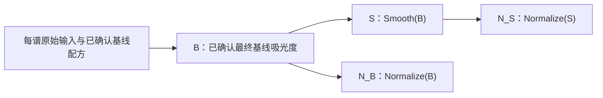

# 普通光谱的后基线平滑与归一化

普通模式保留原来的逐谱基线处理，再增加两个默认关闭的独立步骤。原位 → Prepared → 可选 smoothing → 2D-COS 仍使用原流程。普通后处理不构造 Prepared，不生成扰动轴，也不进入 2D。

## 数据来源



B 必须通过已确认细调或明确跳过细调形成。只有粗调、尚未决定细调时，不能自动使用粗调作为 B。S 和 N 不覆盖母谱；禁止 S→S、N→S、N→N。每条谱以 `(1,n)` 单独运算，与批次中其他样品的数量、顺序、幅度和波数轴无关。

后处理始终作用于父谱完整范围。归一化参考窗口仅确定系数；图形 zoom 只改变显示。不会自动对齐、插值、重采样、删点、裁负值或重新拟合基线。

## 操作与确认

运行 `streamlit run ui/streamlit_app.py`，导入前选择“普通光谱模式”，完成最终基线后进入“普通光谱后处理”页。使用现有侧栏的当前条目和批量选择集，分别在“平滑 Smoothing”和“归一化 Normalization”页签编辑；“分支状态”汇总状态，“结果导出”选择下载内容。每条谱的 S、N_B、N_S 各有独立草稿、预览和确认版；切谱、切页、切归一化来源后草稿仍从工作区业务状态恢复。本版没有普通后处理 CLI 子命令。

先预览，再明确确认。修改草稿保留有效确认版，页面标明未确认修改；确认操作核对谱 ID、来源、有效参数和父级。相同父级与有效参数重复确认不会创造新科学版本。未选中算法的闲置参数不进入科学 hash。

确认 S 不会替用户切换归一化来源或导出来源。更换 S 仅使其旧 N_S 过期；B 和 N_B 保持有效。更换某谱的 B 使该谱全部后处理过期，其他条目不受影响。过期快照可随工作区保存以保留历史，但不能混入当前导出。

“复制参数”只复制草稿，每条目标解析自己的父级并验证实际窗口/区间。目标没有 S 时不自动回退 B。批量预览不确认；批量确认逐项报告成功、失败和跳过理由，失败不会清除其他谱或原有正式结果。

## 平滑

复用现有数值 helpers 及边界规则，默认预览参数：

| 方法 | 默认参数 | 说明 |
|---|---|---|
| Savitzky–Golay | 7 点、2 阶、interp | 窗口须为有效奇数且不大于当前点数，阶数小于窗口 |
| Gaussian | sigma=1 点、truncate=4、reflect | sigma 和 truncate 必须为有限正数 |
| Moving Average | 3 点、reflect | 只沿波数轴 |
| Median | 3 点、reflect | 非线性，可能压平真实窄峰 |

默认不接受非均匀轴；只有显式 expert index-space override 才继续并保存警告，轴保持原样。普通 parser 没有连续分段的输入合同，不支持跨已标注不连续段滤波。

页面显示实际采样间距、窗口物理跨度和现有 QC。7 点窗口在间距 1/2 cm⁻¹ 的轴上分别跨 6/12 cm⁻¹；这不代表仪器分辨率或最优参数。B−S 称“移除分量”，可能同时包含信号、峰形变化和噪声成分；不称“真实噪声”，不自动宣称 SNR 或峰位保真改善。

## 归一化

| 方法 | 系数与用途 |
|---|---|
| none | 关闭，不创建已归一化结果 |
| 全范围最大峰高 | 当前全域最大正峰，`use_absolute=False`，不取负谷绝对值 |
| 指定窗口峰高 | 完整覆盖的参考窗口内最大正峰；全负或零参考拒绝 |
| 指定窗口面积 | 参考窗口真实 x 的梯形面积，默认 absolute |
| 指定范围/全范围面积 | 可指定范围，也可用父谱全域；不以样本点求和代替积分 |
| L2 向量 | 点强度向量范数，受采样密度影响 |
| Min–Max | 固定 0–1，`purpose=display_only`，记录 scale 和 offset，不显示目标值控件 |

峰高、面积和 L2 输出取冻结 core 的 `optional_normalized`；Min–Max 取 `view_data`。core 的 `analysis_data` 保持调用输入，不拿它冒充归一化结果。

absolute 面积分母为对 `abs(y)` 按真实 x 的梯形积分，原谱输出保留正负号；signed 面积保留 y 的符号并要求正且稳定的参考。将 x/y 一起逆序不改变面积定义或系数，输出方向不变。

区间必须完整处于父谱域内且至少包含两个实际采样点。端点不落在采样点上时不插值，记录请求区间、实际采样边界和点数。参考必须超过版本化保护阈值 `max(用户最低参考值, 64 × float64 epsilon × 全域参考尺度)`，且 scale 为有限正数、输出有限；不加 epsilon 继续计算，不自动换算法。单谱 core 返回的 CV=0 不是内标稳定证据，参考选择仍是用户的分析假设。

归一化量使用 `Normalized intensity`；Min–Max 使用显示缩放量标签。二者不能当作吸光度转换为物理 T/%T。B/S 的 T/%T 是吸光度结果的派生显示，沿用旧实现，负吸光度或派生 >100%T 不静默裁剪。

不同谱可有不同配方/参考区间；批次报告记录这些差异，不能据此自动声称样品可作定量比较。

## 导出与工作区

旧普通粗调/最终基线导出路径保持原格式；旧最终导出仍使用 B。新导出显式选择 B、S、N_B、N_S 或全部四分支，默认 B；没有目标分支时拒绝，不回退其他来源。“全部分支”同样要求所有目标分支有效；只有用户明确勾选“只导出有效项（明确排除下表不可用项）”才排除缺失/过期/失败/手动排除项，并保留逐谱、逐分支报告。打包前先查看预检表；未确认草稿不会代替有效确认版参与导出。

下载包是确认数组的序列化，生成后为固定 bytes。导出不调用 baseline、smooth 或 normalize。浮点 CSV 使用 17 位有效数字；逐谱路径包含稳定 ID 和明确分支/quantity。实际输出 x 逐元素一致才允许宽表；方向、长度或坐标不同必须逐谱 CSV 后 ZIP。

新包标识为 `ordinary_spectrum_postprocess_bundle`，schema 1.0，`is_2d_ready=false`，无 `for_2dcos`。N_B 包含 B 父数据；N_S 包含 B 和 S 父数据，同时保存有效配方、完整编辑配方、source/parent/hash、scale/offset/参考区间、QC、警告和依赖版本。专用 verifier 可以显式重放 S/N 来验证父子关系，仍不重新拟合基线；B 只检查保存的基线锚点与数组完整性，不能据此证明原始实验数据的真实性。SHA-256 是完整性校验，不是数字签名。

普通工作区沿用现有安全 ZIP/JSON/NPY 系统；新保存的 workspace.json 为 schema 2.0，通用归档 manifest 仍为 1.0。旧 workspace schema 1.0 读取后新功能为空/关闭，旧 B 保留；旧读取器明确拒绝新的内层 schema。批量勾选集也随工作区保存。保存草稿、确认版和历史父级，省略 preview；恢复不自动计算，未确认草稿需重新预览。恢复会替换当前普通工作区，原位结果独立保留。更新代码前先保存工作区，停止并重启 Streamlit，再恢复 ZIP；热重载不能代替迁移。

归档 reader 限制压缩包 256 MiB、20,000 个成员、单成员 64 MiB、解压总量 512 MiB，并校验成员路径、类型和 SHA-256，数组使用 `allow_pickle=False`。专用 verifier 重放来自归档的 Gaussian 时，还要求 `sigma_points × truncate ≤ 1,000,000`，以限制不可信配方的计算资源；超限包不能通过该重放检查。这是验证器资源限制，不改变平滑算法。

可再生合成输入见 [示例](../examples/ordinary_postprocessing/README.md)。真实实验输入、校正/平滑/归一化输出及私有 hash 均应留在 Git 忽略的 `outputs/`，不要提交。

专用验证示例：

```python
from pathlib import Path
from ftir_workbench.batch.postprocessing_export import verify_postprocessing_export

payload = Path("outputs/my_ordinary_postprocessing.zip").read_bytes()
assert verify_postprocessing_export(payload, recompute=False)  # 格式、父级、数组完整性
assert verify_postprocessing_export(payload, recompute=True)   # 另外重放 S / N，不拟合 B
```

重放使用当前安装的数值实现；更换 NumPy/SciPy 版本后精确重放可能失败，应核查记录的环境。历史 B 的科学实现 hash 和 core 版本可保留，但旧快照未单独记录的历史依赖版本不能从 hash 反推；导出环境版本与当时计算环境分开标识。

本次实际浏览器已完成合成异轴输入、独立三谱四分支、宽表、过期排除和新会话工作区恢复；最终 v0.3.1 服务重启后还再次恢复并确认、下载新 S/N_S，实际计算与导出版本均为 0.3.1。操作步骤、下载数组审计、失败定位尝试及未执行范围见 [浏览器验收记录](ordinary_postprocessing_browser_acceptance.md)。完整本地 v0.3.1 测试为 1238 passed、5 个既有 warning，见 [最终 pytest 日志](../artifacts/validation/v0.3.1/phase5/pytest-final.log)；实际基准与完成提交 SHA 见 [交付报告](../artifacts/validation/v0.3.1/REPORT.md)。
